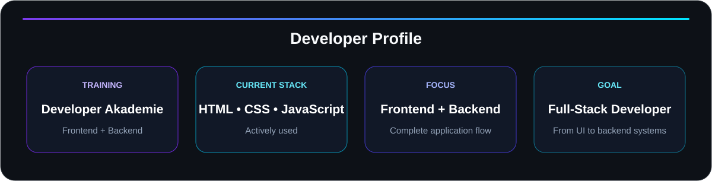
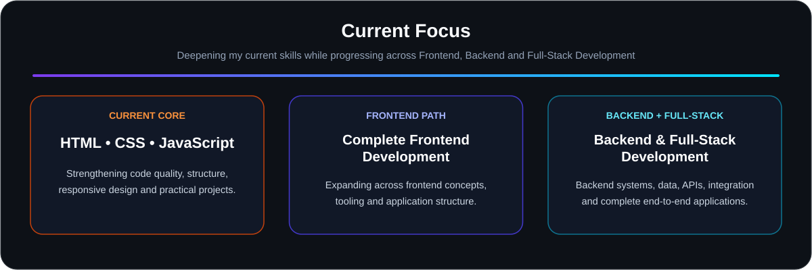
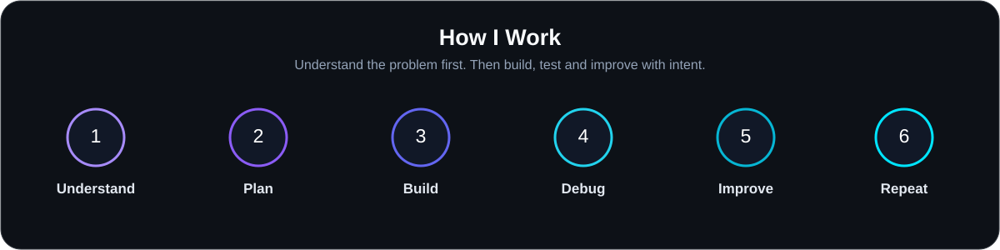
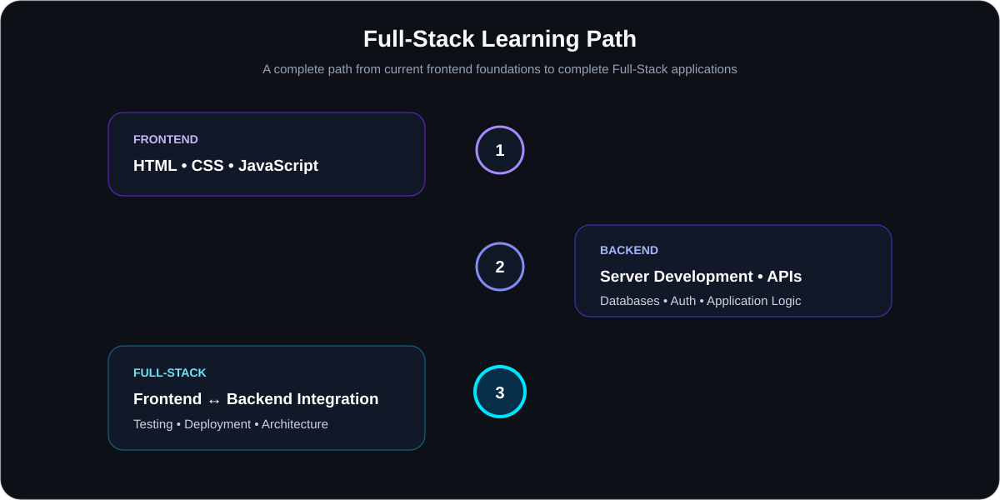

  

  

<h1 align="center">Sergej G.</h1>
<h3 align="center">Building strong frontend and backend skills on the path to Full-Stack Development.</h3>

I learn by building real projects, understanding how code works and improving each solution step by step.

---

## 👨‍💻 About Me

I'm **Sergej G.** and I'm developing my skills across the complete path from **Frontend to Backend and Full-Stack Development**.

I already work confidently with **HTML, CSS and JavaScript** and continue to deepen those skills while moving through the wider frontend ecosystem and into backend development.

My goal is to understand and build complete applications — from interface and client-side logic to backend systems, data flow and application architecture.

  

---

## 🛠️ Current Tech Stack

  

  
  
  

<strong>Current core stack:</strong> HTML • CSS • JavaScript

---

## 🚀 Current Focus

  

  My current priority is to strengthen <strong>HTML, CSS and JavaScript</strong>, complete the broader frontend path,
  and progressively expand into <strong>backend development and Full-Stack application development</strong>.

---

## 📊 GitHub Statistics

  

  
  

Statistics are generated from activity and repositories on GitHub.

---

## 🧭 How I Work

  

<strong>I want to understand why code works — not just copy a solution.</strong>

Clean code • Logical structure • Responsive interfaces • Debugging • Maintainability • Continuous improvement

---

## 🌱 Full-Stack Learning Path

  

  This roadmap represents the direction of my development — from my current frontend foundation
  toward complete, production-ready Full-Stack applications.

---

## 🧩 Featured Projects

Projects are where theory becomes practical experience.

I use real projects to strengthen my current skills, learn new concepts and build a portfolio that shows my development over time.

<table width="100%">
  <tr>
    <td align="center" width="33%"><strong>Project 01</strong> Coming soon</td>
    <td align="center" width="33%"><strong>Project 02</strong> Coming soon</td>
    <td align="center" width="33%"><strong>Project 03</strong> Coming soon</td>
  </tr>
</table>

---

## 🎓 Education & Training

  <strong>Developer Akademie</strong> 
  Frontend & Backend Development

Current core technologies: <code>HTML</code> • <code>CSS</code> • <code>JavaScript</code>

---

## 📫 Connect

The best place to follow my development is here on GitHub.

  

---

<h2 align="center">&lt;/&gt; Coded by Sergej</h2>

<strong>Learning. Building. Improving.</strong> Frontend • Backend • Full-Stack

